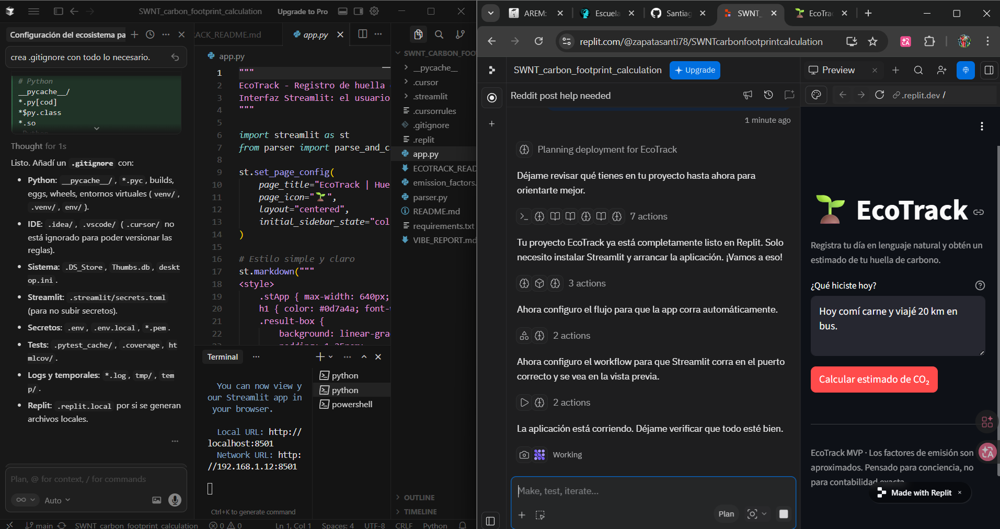

# EcoTrack — MVP de Huella de Carbono en Lenguaje Natural

Aplicación web sencilla para que una persona registre su día en **lenguaje natural**
(*"Hoy comí carne y viajé 20 km en bus"*) y obtenga un **estimado de huella de carbono (kg CO₂e)**.

El foco del proyecto es practicar **Vibe Coding**: configurar el ecosistema (Cursor + Replit),
definir reglas claras para la IA y orquestar el desarrollo del MVP más que escribir cada línea a mano.



---

## 1. Funcionalidad de EcoTrack

- **Entrada**: texto libre en español describiendo el día (comidas y transporte, con distancias).
- **Procesamiento**:
  - Un parser sencillo identifica:
    - **Transporte**: patrones tipo `20 km en bus`, `15 km en coche`, `5 km en bici`, etc.
    - **Alimentación**: menciones como `comí carne`, `almorcé pollo`, `solo ensalada`, etc.
  - Se aplican **factores de emisión aproximados** para cada actividad (bus, coche, carne, pollo, vegetariano, etc.).
- **Salida**:
  - Total estimado en **kg CO₂e**.
  - Desglose por actividades (transporte y alimentación).
  - Mensajes claros en español; código y nombres técnicos en inglés.

> Importante: los valores son aproximados y sirven para **conciencia y educación**, no para contabilidad de carbono estricta.

---

## 2. Stack y arquitectura

- **Lenguaje**: Python.
- **UI**: Streamlit.
- **Arquitectura**:
  - `app.py`: interfaz Streamlit (entrada de texto, botón de cálculo, visualización de resultados).
  - `parser.py`: lógica de parsing de lenguaje natural → actividades estructuradas.
  - `emission_factors.py`: diccionarios y funciones de factores de emisión (transporte, comida, electricidad).
  - `.cursorrules` y `.cursor/rules/`: reglas de proyecto para guiar a la IA en Cursor.
  - `.replit`: configuración para ejecutar y desplegar la app en Replit.

La lógica está separada para que sea fácil:
- Ajustar factores de emisión.
- Mejorar el parser.
- Sustituir el parser manual por un LLM en el futuro si se desea.

---

## 3. Ejecución local

Requisitos: Python 3.x instalado.

```bash
pip install -r requirements.txt
python -m streamlit run app.py
```

Luego abre en el navegador la URL que muestre la terminal (por defecto `http://localhost:8501`).

Si Streamlit pide **Email** la primera vez, puedes simplemente pulsar Enter (es opcional).

---

## 4. Ejecución en Replit

1. Crear un Repl (Python) e **importar este repositorio** o subir los archivos.
2. En la shell de Replit:
   ```bash
   pip install -r requirements.txt
   ```
3. Asegurar que el comando de ejecución sea:
   ```bash
   streamlit run app.py --server.port=3000 --server.address=0.0.0.0
   ```
   (Esto también está reflejado en `.replit`).
4. Pulsar **Run** y abrir la URL que ofrece Replit.
5. Opcional: usar la pestaña **Deploy** para obtener una **URL pública** para entregar.

---

## 5. Uso rápido

Al abrir EcoTrack, prueba frases como:

- *"Hoy comí carne y viajé 20 km en bus"*
- *"Desayuné huevos, almorcé pollo y recorrí 15 km en coche"*
- *"Solo ensalada y 5 km en bici"*

La app mostrará un total aproximado (kg CO₂e) y un pequeño desglose de las actividades detectadas.

---

## 6. Vibe Coding y documentos relacionados

Este proyecto incluye:

- **`.cursorrules`** y **`.cursor/rules/ecotrack-standards.mdc`**: definen la visión de EcoTrack y las
  preferencias de código (modularidad, stack, estilo).
- **`VIBE_REPORT.md`**: documento corto que resume cómo se configuró el ecosistema, dificultades al
  delegar a la IA y la experiencia de pasar de “escribir código” a “orquestar una visión”.

Con esto, el repositorio queda alineado con el proyecto integrador de **Vibe Coding** para EcoTrack.
